# Declarative Agent + FastAPI Backend (Entra ID)

This repo contains two parts:

1. **`backend/`** — A FastAPI service protected by Microsoft Entra ID. It validates
   JWT bearer tokens issued for a custom App Registration (audience = the API's
   Application ID URI) and exposes a small "tasks" API.
2. **`appPackage/`** — A Microsoft 365 **declarative agent** app package
   (Teams/M365 Copilot). The agent calls the backend through an **API plugin**
   that uses **OAuth 2.0 (auth code)** against Entra ID, so each call carries
   a user-delegated Entra token.

```
declagent/
├── backend/                        FastAPI service
│   ├── app/
│   │   ├── main.py                 FastAPI app
│   │   ├── auth.py                 Entra ID JWT validation
│   │   ├── models.py               Pydantic models
│   │   └── routers/tasks.py        /tasks endpoints
│   ├── requirements.txt
│   └── .env.example
└── appPackage/                         M365 Copilot declarative agent
    ├── manifest.template.json          Teams app manifest (with ${{TEAMS_APP_ID}})
    ├── declarativeAgent.json           Declarative agent definition
    ├── ai-plugin.template.json         API plugin manifest (with ${{OAUTH_CONFIG_ID}})
    └── apiSpecification.template.yaml  OpenAPI 3 spec (with ${{BASE_URL}})
```

> The `*.template.*` files contain `${{VARIABLE}}` placeholders. Section 4
> shows how to substitute them from `backend/.env` to produce the final
> `manifest.json`, `ai-plugin.json` and `apiSpecification.yaml` that go into
> the uploadable zip.

---

## 1. Register two apps in Microsoft Entra ID

You need two app registrations in the same tenant:

### A. Backend API app
- **Name:** `declagent-api`
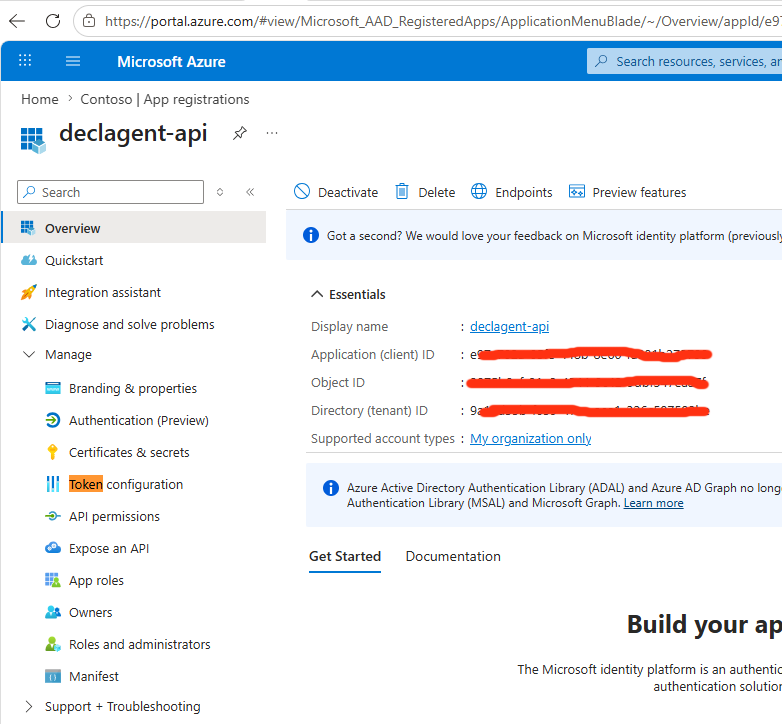
- Leave API Permission to Microsoft.Graph User.Read
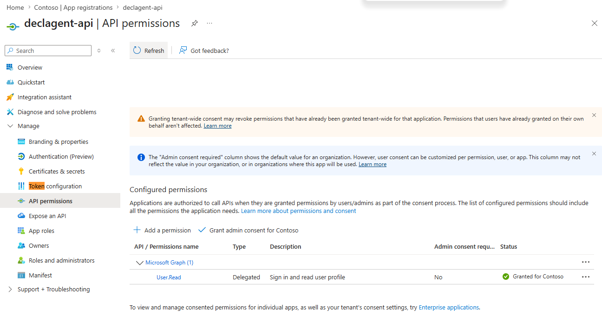
- Expose an API → **Application ID URI**: `api://<API_APP_ID>` (default).
- Add a delegated scope, e.g. `access_as_user`.
- Note: **Tenant ID**, **API App ID**, scope full name
  `api://<API_APP_ID>/access_as_user`.
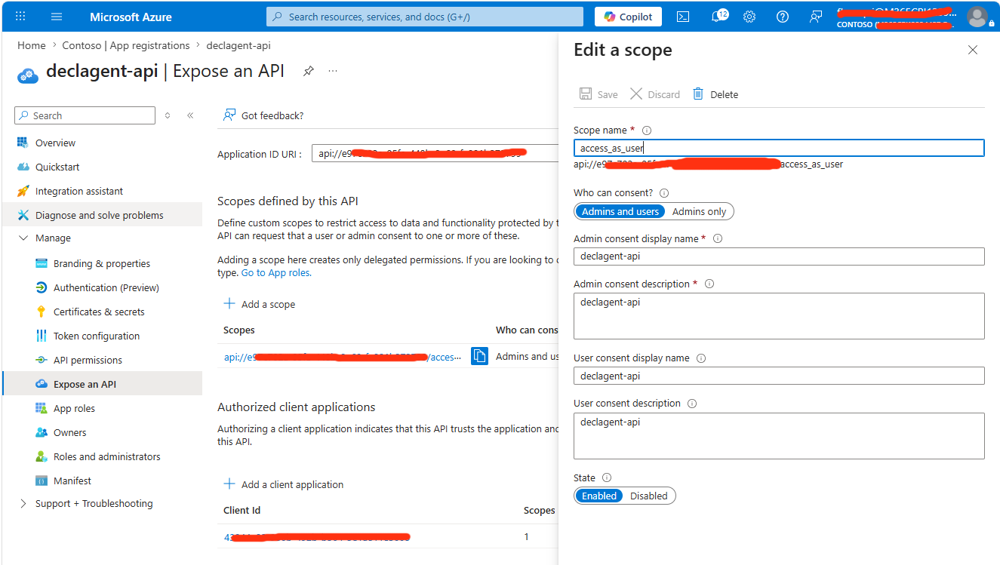
- Update the Application manifest to support Token Version 2
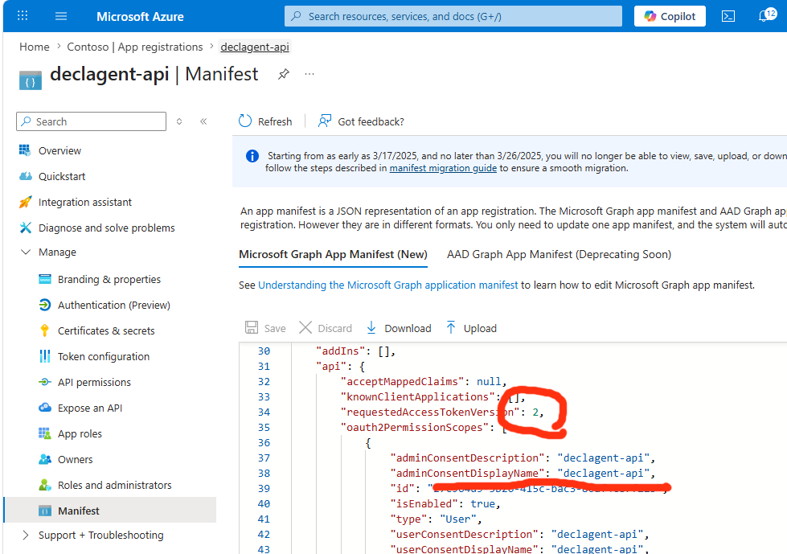

### B. Copilot client app (used by the declarative agent's plugin)
- **Name:** `declagent-copilot-client`
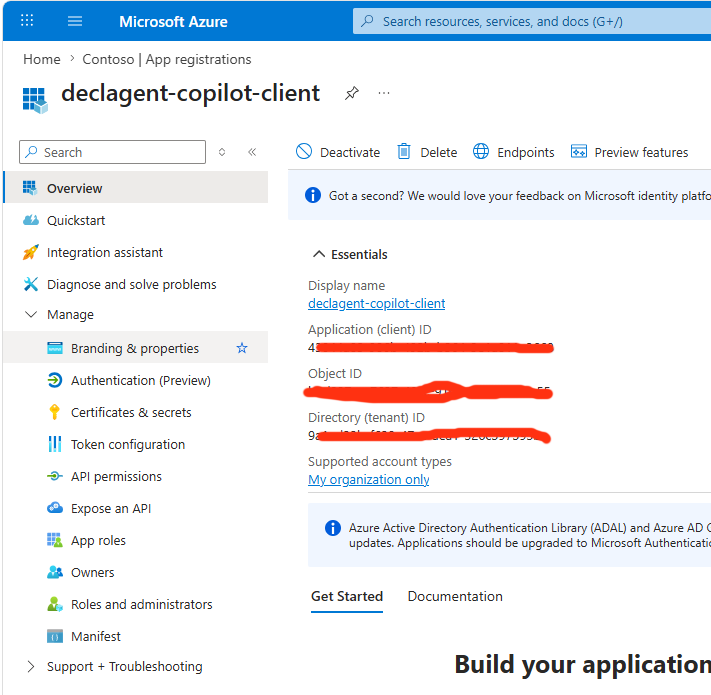
- Platform: **Web**, redirect URI:
  `https://teams.microsoft.com/api/platform/v1.0/oAuthRedirect`
  (Microsoft 365 Copilot OAuth redirect).
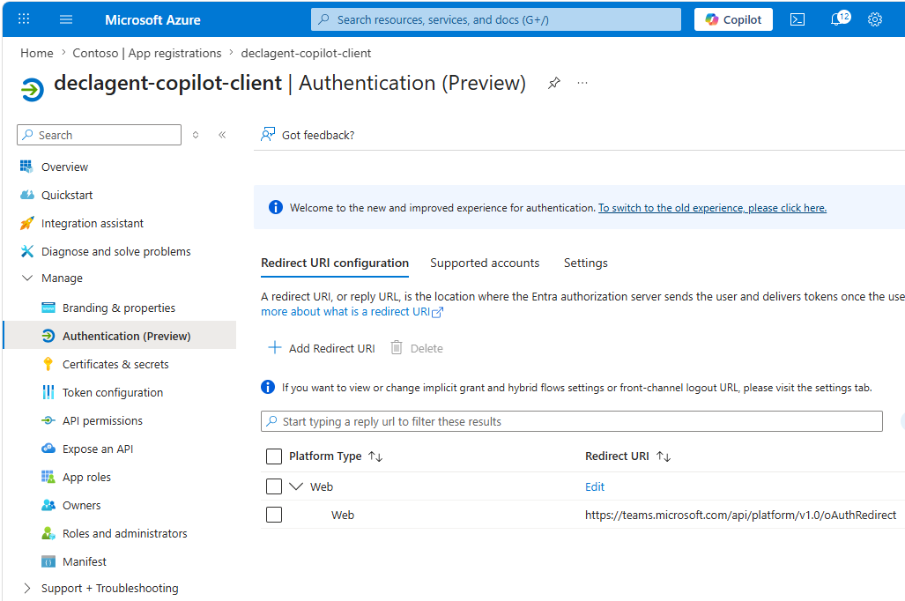
- API permissions → **APIs my organization uses** → select `declagent-api` → delegated
  `access_as_user`. Grant admin consent.
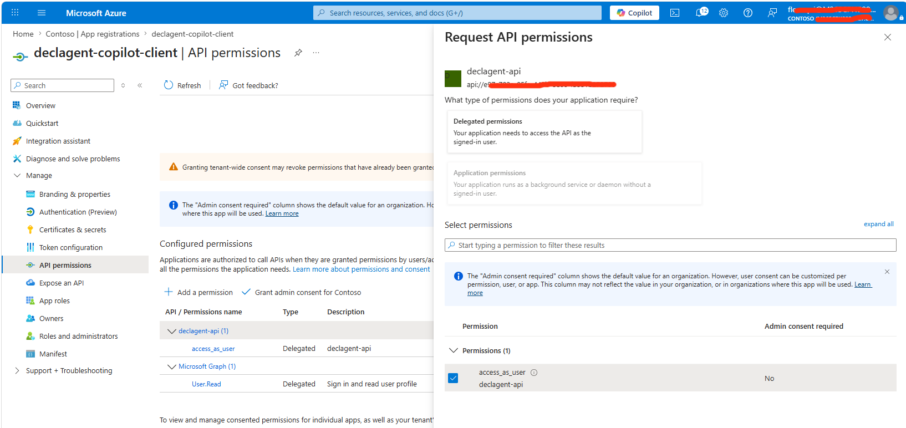
- Update the Backend API App to accept the new Client:
  Authorize the client to call the API: in the **API app's**
  *Expose an API* → *Authorized client applications*, add the Copilot client
  app's **Application (client) ID**. This avoids a second consent prompt.
  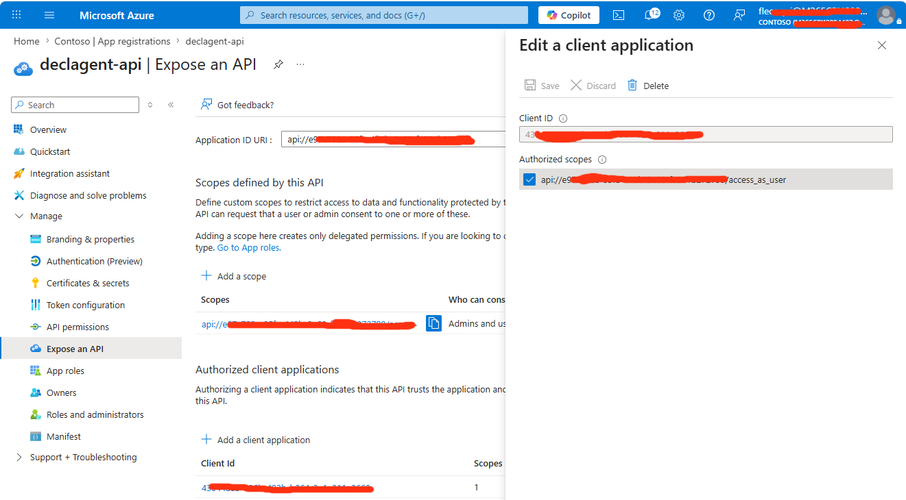
- Note: **Copilot client App ID** and create a **client secret** — you'll
  register the secret in Teams Developer Portal as an OAuth client registration
  and reference its ID from `ai-plugin.json`.
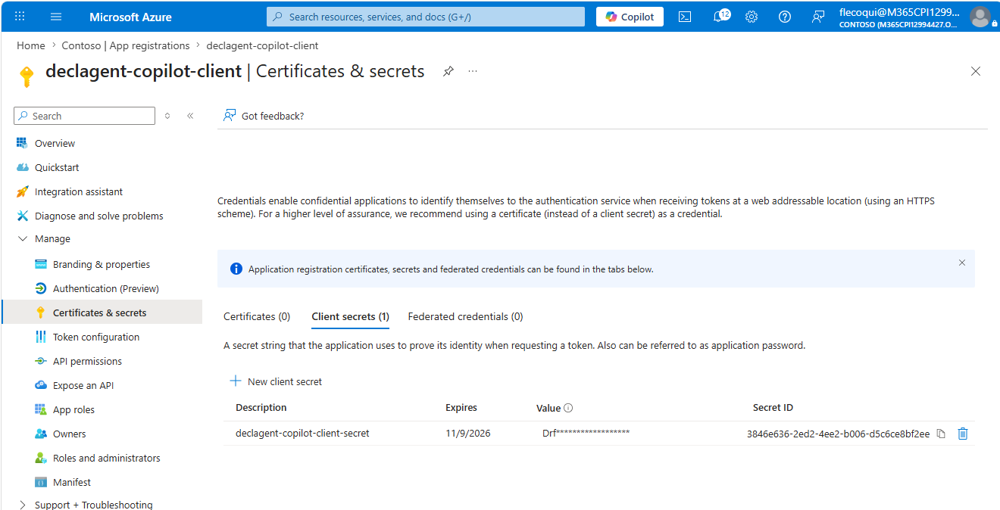

## 2. Run the backend

```bash
cd backend
cp .env.example .env       # fill in TENANT_ID and API_APP_ID
python -m venv .venv && source .venv/bin/activate
pip install -r requirements.txt
uvicorn app.main:app --reload --port 8000
```

Expose it publicly (Copilot must reach it over HTTPS), e.g.:

```bash
# either dev tunnel
devtunnel host -p 8000 --allow-anonymous
# or ngrok
ngrok http 8000
```

Set `BASE_URL` in `backend/.env` to that public HTTPS URL — it is injected
into `apiSpecification.yaml` (`servers[0].url`) at packaging time (section 4).

## 3. Register the OAuth client in the Teams Developer Portal

The declarative agent's API plugin uses an `OAuthPluginVault` reference rather
than embedding the client ID/secret in the package. You create that reference
once in the **Teams Developer Portal**, then paste its GUID into
`ai-plugin.json` as `${{OAUTH_CONFIG_ID}}`.

### 3.1 Open the Teams Developer portal

Sign in at **https://dev.teams.microsoft.com** with an account that has the
**Teams App Developer** (or higher) role in the same tenant as your two app
registrations.

### 3.2 Create the OAuth client registration

1. In the left rail, expand **Tools**.
2. Click **OAuth client registrations** → **New OAuth client registration**.
3. Fill the form:

   | Field                    | Value                                                                                          |
   | ------------------------ | ---------------------------------------------------------------------------------------------- |
   | **Registration name**    | `declagent-tasks-api` (any friendly label)                                                     |
   | **Base URL**             | The public HTTPS base URL of your FastAPI backend (same host as `servers[0].url` in the spec). |
   | **Application ID / Client ID** | The **Copilot client app's** Application (client) ID (app **B** above).                  |
   | **Client secret**        | A secret you generated on the Copilot client app (value, not the secret ID).                   |
   | **Authorization endpoint** | `https://login.microsoftonline.com/<TENANT_ID>/oauth2/v2.0/authorize`                        |
   | **Token endpoint**       | `https://login.microsoftonline.com/<TENANT_ID>/oauth2/v2.0/token`                              |
   | **Refresh endpoint**     | Same as the token endpoint.                                                                    |
   | **Scope**                | `api://<API_APP_ID>/access_as_user offline_access` (space-separated; `offline_access` enables refresh tokens) |
   | **Enabled**              | On                                                                                             |

   > Use your tenant GUID for `<TENANT_ID>` (single-tenant). Use `common` only
   > if both app registrations are configured as multi-tenant.

4. Click **Save**. The portal returns a **Registration ID** (a GUID) — copy
   it into `backend/.env` as `OAUTH_CONFIG_ID`. It is substituted into
   `ai-plugin.json` at packaging time.

  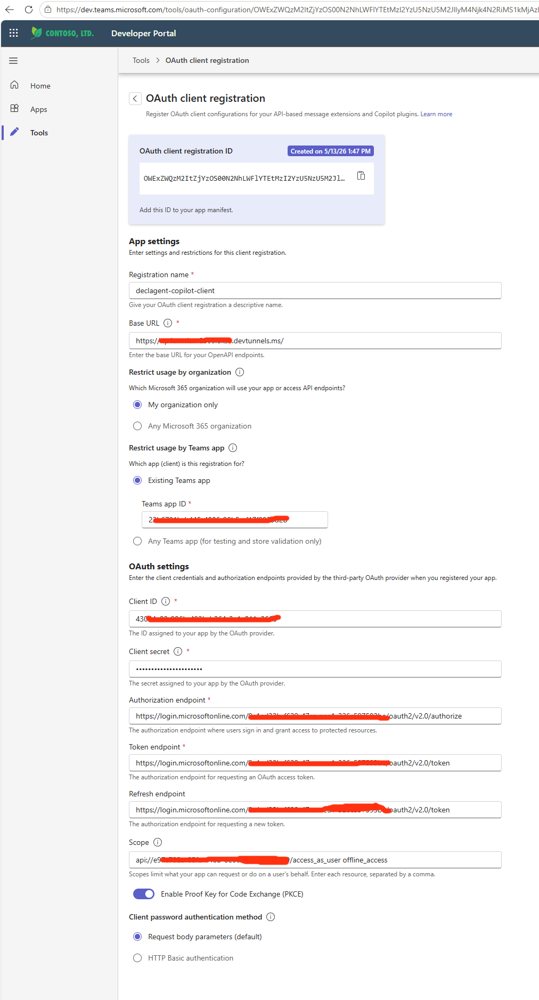

### 3.3 Confirm the redirect URI on the Entra app

Copilot completes the auth-code flow against this fixed redirect URI:

```
https://teams.microsoft.com/api/platform/v1.0/oAuthRedirect
```

Make sure it is listed under **Authentication → Web → Redirect URIs** on the
Copilot client app registration (app **B**). Without it, the consent popup
ends with `AADSTS50011: redirect URI mismatch`.

### 3.4 Collect the values in `backend/.env`

The template files in `appPackage/` are rendered from variables in
`backend/.env`. Make sure all of the following are filled in (see
`backend/.env.example`):

| Variable          | Used in                          | Value                                                                                |
| ----------------- | -------------------------------- | ------------------------------------------------------------------------------------ |
| `TEAMS_APP_ID`    | `manifest.template.json`         | A fresh GUID (e.g. `python -c "import uuid;print(uuid.uuid4())"`).                   |
| `OAUTH_CONFIG_ID` | `ai-plugin.template.json`        | The **Registration ID** from step 3.2.                                               |
| `BASE_URL`        | `apiSpecification.template.yaml` | Public HTTPS URL of your backend (same as the OAuth registration's **Base URL**).    |

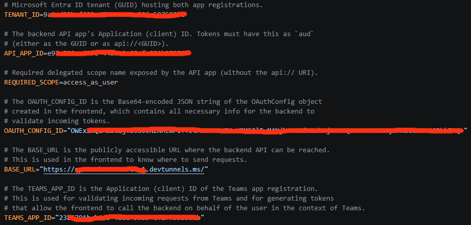

Also make sure `TENANT_ID`, `API_APP_ID` and `REQUIRED_SCOPE` are set — they
are consumed by the backend at runtime.

Finally, add two PNGs next to the manifest in `appPackage/`:

- `color.png` — 192×192 colored icon
- `outline.png` — 32×32 transparent outline icon

### 3.5 Updating or rotating the registration

- **Edit:** Tools → OAuth client registrations → pick the entry → **Edit**.
  The Registration ID does not change, so no repackaging is needed.
- **Rotate the secret:** generate a new secret on the Entra client app, paste
  it into the same registration, save. Existing sideloaded packages keep
  working.
- **Delete:** removes the binding for every package that references it; users
  will be prompted to sign in again the next time the agent runs.

## 4. Build the app package

The app package is produced by:

1. Reading the variables from `backend/.env`.
2. Substituting every `${{VARIABLE}}` placeholder in each
   `appPackage/*.template.*` file with the matching value.
3. Writing the rendered files (`manifest.json`, `ai-plugin.json`,
   `apiSpecification.yaml`) into a `build/appPackage/` folder.
4. Zipping that folder together with the static `declarativeAgent.json` and
   the two icons into `declagent.zip`.

### 4.1 Render the templates

Run this from the repo root. It loads `backend/.env`, walks every
`appPackage/*.template.*` file, replaces each `${{NAME}}` with the value of
the `NAME` environment variable, and writes the result into
`build/appPackage/` with the `.template` segment stripped:

```bash
mkdir -p build/appPackage

# Load variables from backend/.env into the current shell.
set -a
. ./backend/.env
set +a

python - <<'PY'
import os, re, pathlib
src = pathlib.Path("appPackage")
dst = pathlib.Path("build/appPackage")
dst.mkdir(parents=True, exist_ok=True)
pattern = re.compile(r"\$\{\{\s*([A-Z0-9_]+)\s*\}\}")

def render(text: str) -> str:
    def repl(m):
        name = m.group(1)
        if name not in os.environ:
            raise SystemExit(f"Missing variable {name} in backend/.env")
        return os.environ[name]
    return pattern.sub(repl, text)

for path in src.iterdir():
    if path.is_file() and ".template." in path.name:
        out = dst / path.name.replace(".template", "")
        out.write_text(render(path.read_text()))
        print(f"rendered {path} -> {out}")
    elif path.is_file():
        # Static files (declarativeAgent.json, color.png, outline.png) are copied as-is.
        (dst / path.name).write_bytes(path.read_bytes())
        print(f"copied   {path} -> {dst / path.name}")
PY
```

After this step `build/appPackage/` contains the fully rendered
`manifest.json`, `ai-plugin.json` and `apiSpecification.yaml` (with no
`${{...}}` left), plus the static `declarativeAgent.json`, `color.png` and
`outline.png`.

### 4.2 Zip and upload

```bash
cd build/appPackage
zip ../../declagent.zip manifest.json declarativeAgent.json ai-plugin.json apiSpecification.yaml color.png outline.png
cd ../..
```

Upload `declagent.zip` to **Microsoft 365 Copilot → Agents → Add agent →
Upload custom agent**, or sideload via the Teams Developer Portal.

> Re-run section 4.1 whenever you change `backend/.env` (e.g. a new tunnel
> URL in `BASE_URL`) or edit any `*.template.*` file.

## 5. Try it

In Microsoft 365 Copilot, pick the **Task Assistant** agent and ask:

> *List my tasks.*
> *Add a task: "Write the quarterly report" due next Friday.*

Copilot will perform the OAuth dance, get an Entra token for
`api://<API_APP_ID>/access_as_user`, and call the FastAPI backend.
